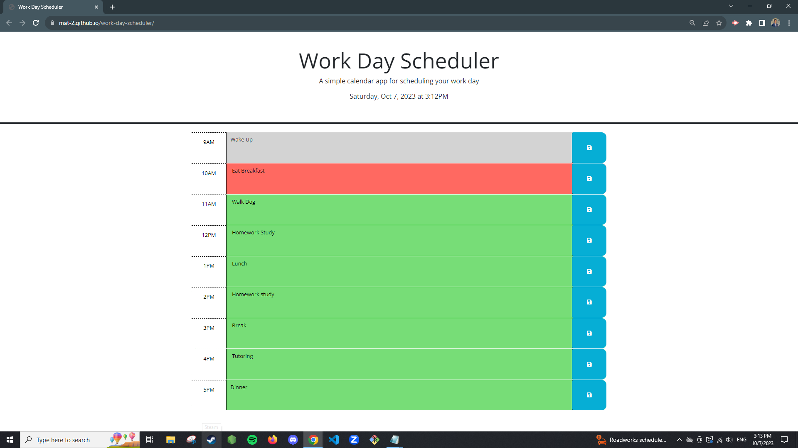

# Description

This project helped tested my skills working around local storage and using JQuery. Evertime you write something in the text areas and press the save button, it will save the notes you typed and will be locally stored and visually seen once visiting the page again. I explored ways that local storage capabilities that worked, but learned that were other ways that were not only faster to create, but also efficient and easier to manage. The buttons and local storage were initially challenging because either the note inputs being written were not saving, or a button will only work on one instead of the rest. I struggled trying to figure out how to change the colors of each of the text areas based on the time of day. Other than that, it was a great experience to get practice to understandng local storage and working with unique, individual pieces to make the website save data for each note created.

## Installation

- BootStrap v.5.1.3
- JQuery v.3.4.1
- DayJS v.1.11.3

## License

Refer to LICENSE

## References

- https://www.queryselectorall.com/buttons
- https://medium.com/@ipshubham/the-ultimate-guide-to-understanding-local-storage-2a27fdb80544
- https://day.js.org/docs/en/display/format
- https://www.w3schools.com/js/js_arrow_function.asp
- https://www.w3schools.com/jsref/jsref_foreach.asp
- https://www.w3schools.com/jquery/jquery_events.asp

## Screenshots

